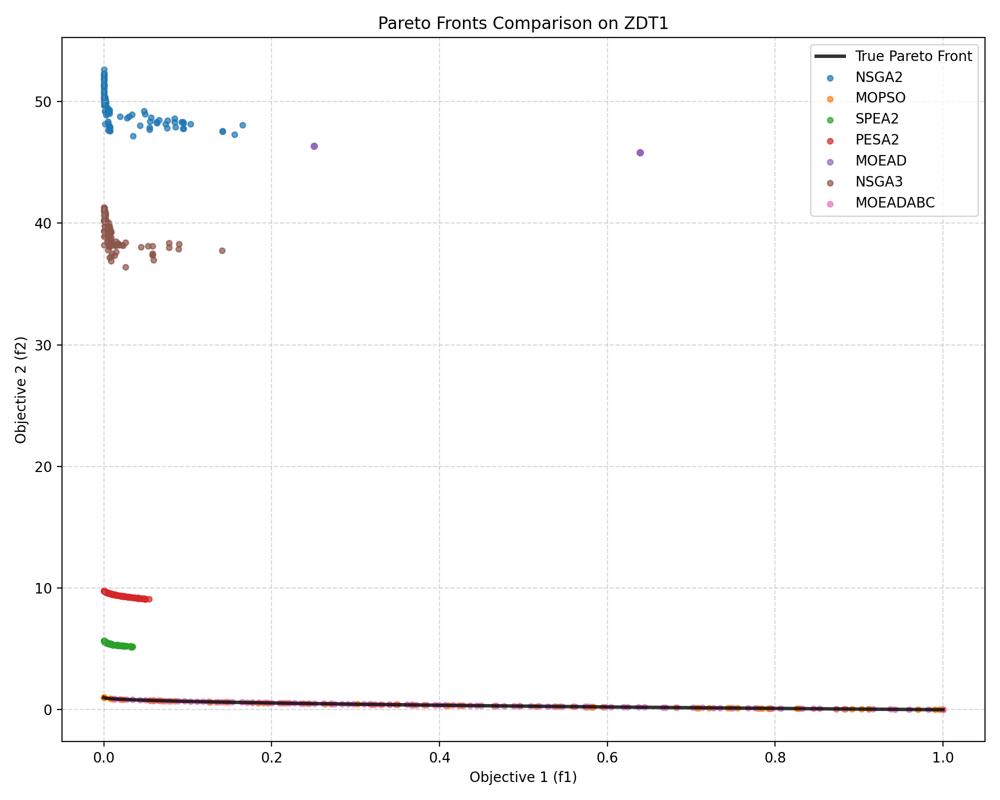

<div align="center">

# 🧬 Evolutionary Algorithms Benchmark

### A Python comparison of seven multi-objective optimisation algorithms on ZDT1

[](LICENSE)
[](#)
[](#algorithms)
[](#benchmark-setup)

</div>

---

## Overview

This repository benchmarks **seven classic multi-objective evolutionary algorithms** implemented from scratch in Python. All algorithms are evaluated on the **ZDT1** test problem and compared using the **Inverted Generational Distance (IGD)** metric and wall-clock runtime.

---

## Algorithms

| # | Algorithm | File |
|---|---|---|
| 1 | **MOEAD-ABC** — Multi-Objective ABC based on Decomposition | [`moeadabc.py`](moeadabc.py) |
| 2 | **MOEA/D** — Multi-Objective Evolutionary Algorithm / Decomposition | [`moead.py`](moead.py) |
| 3 | **MOPSO** — Multi-Objective Particle Swarm Optimisation | [`mopso.py`](mopso.py) |
| 4 | **NSGA-II** — Non-dominated Sorting GA II | [`nsga2.py`](nsga2.py) |
| 5 | **NSGA-III** — Non-dominated Sorting GA III | [`nsga3.py`](nsga3.py) |
| 6 | **SPEA2** — Strength Pareto Evolutionary Algorithm 2 | [`spea2.py`](spea2.py) |
| 7 | **PESA-II** — Pareto Envelope-based Selection Algorithm II | [`pesa2.py`](pesa2.py) |

---

## Quick Start

```bash
# Run all algorithms and generate figures
python run_all.py

# Or run a single algorithm
python main.py -algorithm moeadabc -problem zdt1 -N 100
```

---

## Benchmark Setup

| Parameter | Value |
|---|---|
| Problem | ZDT1 (2 objectives, 30 decision variables) |
| Population size | 100 |
| Function evaluations | 10,000 |
| Performance metric | IGD ↓ (lower is better) |

---

## Results

### Performance Summary

| Rank | Algorithm | IGD Score | Runtime (s) |
|:---:|---|:---:|:---:|
| 🥇 | **MOPSO** | **9.59e-03** | 18.74 |
| 🥈 | **MOEAD-ABC** | **9.60e-03** | **2.70** ⚡ |
| 3 | SPEA2 | 4.85e+00 | 13.53 |
| 4 | PESA-II | 8.77e+00 | 6.64 |
| 5 | NSGA-III | 3.61e+01 | 32.24 |
| 6 | MOEA/D | 4.55e+01 | 19.24 |
| 7 | NSGA-II | 4.68e+01 | 30.85 |

> **Key takeaways:**
> - MOPSO and MOEAD-ABC both achieve near-perfect Pareto front approximation (~0.009 IGD)
> - MOEAD-ABC is **7× faster** than MOPSO at equivalent quality
> - GA-based algorithms (NSGA-II/III, MOEA/D) need larger budgets or advanced operators (SBX / polynomial mutation) to fully converge on 30-variable problems

---

### Pareto Front Comparison



<details>
<summary>Individual algorithm plots</summary>

| MOEAD-ABC | MOPSO |
|---|---|
|  |  |

| SPEA2 | PESA-II |
|---|---|
|  |  |

| NSGA-III | MOEA/D | NSGA-II |
|---|---|---|
|  |  |  |

</details>

---

## Repository Structure

```
Evolutionary-Algorithms/
├── main.py          # Single-algorithm entry point
├── run_all.py       # Run all algorithms and save results
├── individual.py    # Solution representation
├── moeadabc.py      # MOEAD-ABC
├── moead.py         # MOEA/D
├── mopso.py         # MOPSO
├── nsga2.py         # NSGA-II
├── nsga3.py         # NSGA-III
├── spea2.py         # SPEA2
├── pesa2.py         # PESA-II
├── figures/         # Generated Pareto front plots
├── results/         # Raw numerical results
└── RESULTS.md       # Detailed benchmark report
```

---

## License

Released under the [MIT License](LICENSE).
